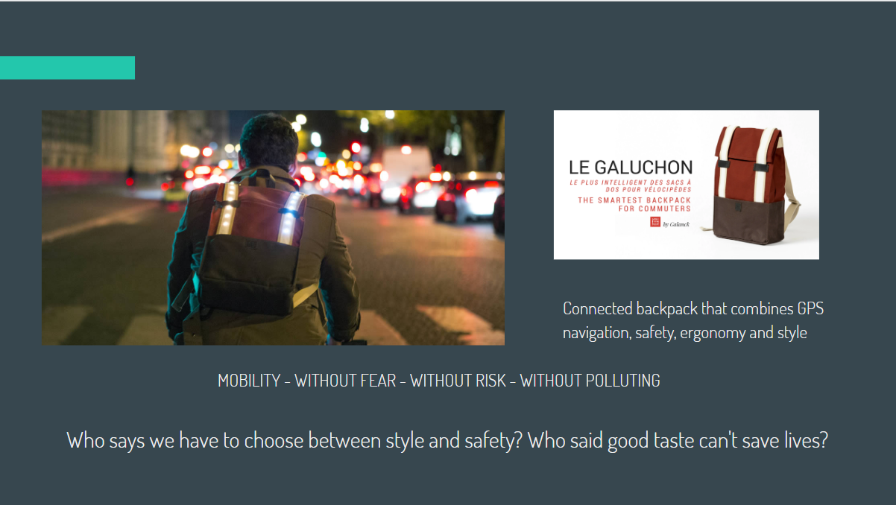
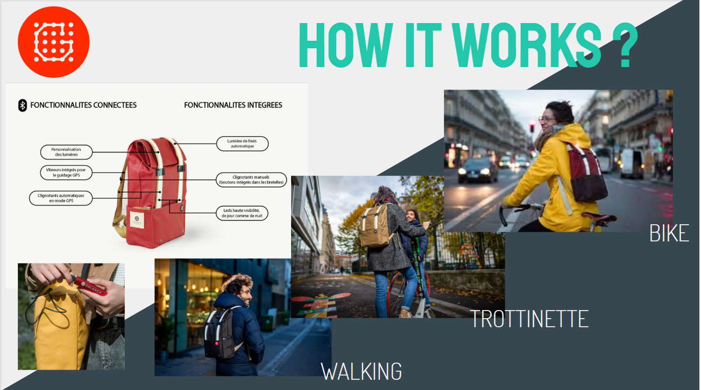
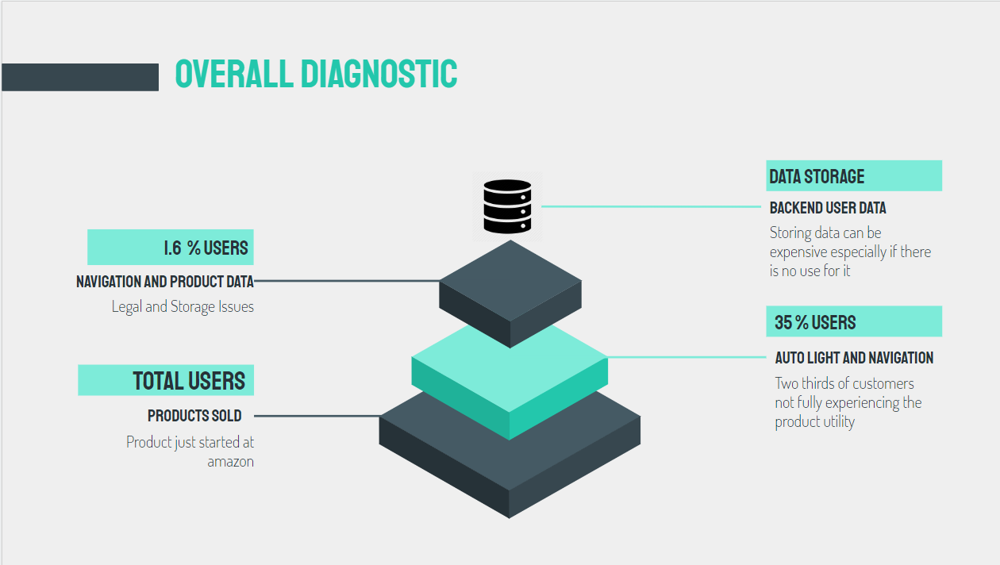

# Galanck: Data helping business

# Introduction

Galanck is  Startup that manufacture a connected backpack that combines GPS navigation, safety, ergonomy and style, my project was to help them on their challanges using Data Analytics tools

